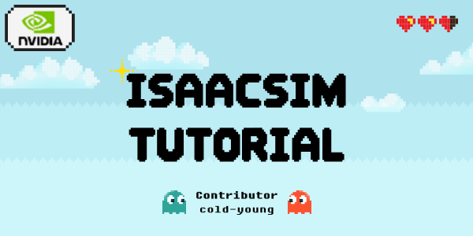

# Isaacsim tutorial 

[](https://docs.omniverse.nvidia.com/isaacsim/latest/overview.html)
[](https://docs.python.org/3/whatsnew/3.10.html)
[](https://releases.ubuntu.com/20.04/)


Contributor: [Chanyoung Ahn](https://github.com/cold-young) 

**IsaacSim tutorial** is Isaacsim examples for KAIST RIRO Lab member or everyone.  
I provide various examples for creating and manipulating customized assets/robots.

- **Supplymentary files**: [Tutorial_DAY1 (KOR)](https://drive.google.com/file/d/1TtW2xgF41CknZzR0cW_nWjrUoT75iXrx/view?usp=sharing)


## Requirement
To set a PYTHON_PATH variable in the terminal that links to the python executable, we can run a command that resembles the following. Make sure to update the paths to your local path.

```shell
# For Linux: 
alias PYTHON_PATH=~/.local/share/ov/pkg/isaac-sim-*/python.sh
```

```shell
# Install other package in isaacsim environment
PYTHON_PATH -m pip install ## 
```
* But, Please install other package in your virtual environment like conda.

### Run Examples 
```shell
# For Run:
PYTHON_PATH tutorials/[FOLDER_NAME]/[FILE_NAME].py
```
## 1DAY - Create Asset / Robot

- This tutorial explain HOW TO CREATE customized assets. 
- We enable make various objects from your own cad files.

### Example 1: Add and spawn your asset
```shell
# Spawn your asset
PYTHON_PATH tutorials/00_assets/spawn_scene.py
```

### Example 2: Create your robot and get robot states
```shell
# Spawn your asset
PYTHON_PATH tutorials/01_robots/move_robot.py
```

## TODO
#### Sensors
- Use wrist camera on robot arm

#### NVIDIA ORBIT > Isaac Lab
- How Add new task? 
- Respawn deformed object using 'Soft_Object' class - (pcd spawn)
- Data collect from RGB-D camera(RGB, Depth, Point cloud..)

## Acknowledgement
NVIDIA Isaac Sim is available freely under [individual license](https://www.nvidia.com/en-us/omniverse/download/). For more information about its license terms, please check [here](https://docs.omniverse.nvidia.com/app_isaacsim/common/NVIDIA_Omniverse_License_Agreement.html#software-support-supplement).

This tutorial package is released under [MIT License](LICENSE).

## Citation

```text
@misc{coldyoung2024isaac-tutorial,
	author = {Chanyoung Ahn},
	title = {Isaacsim_tutorial},
	year = {2024},
}
```
