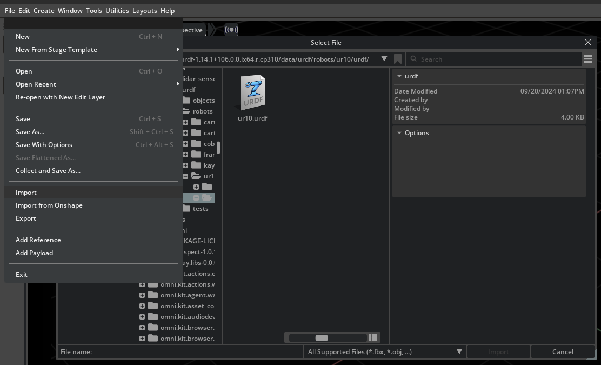
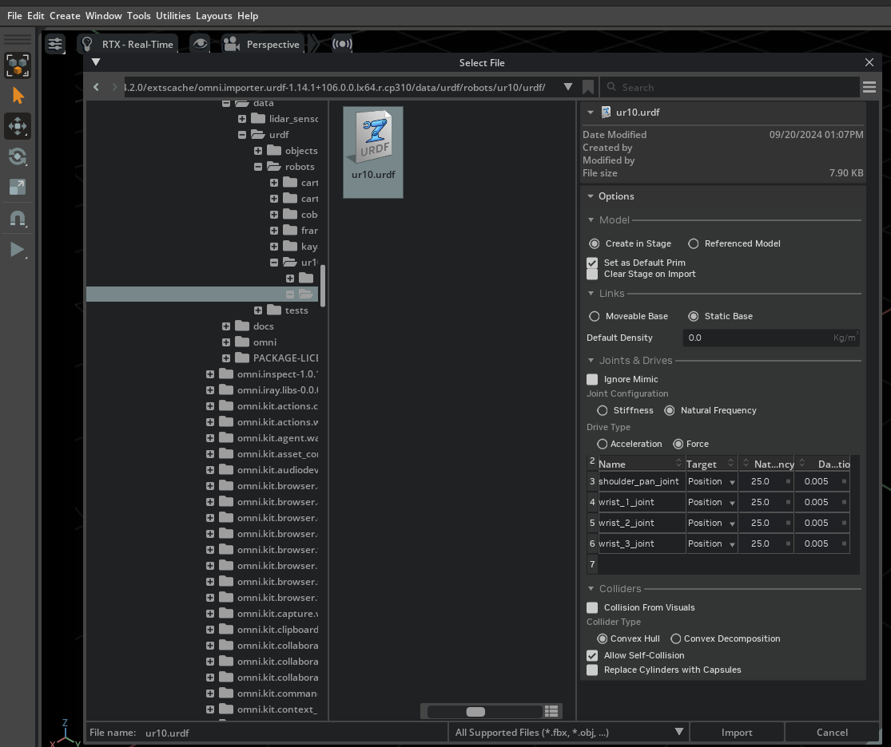
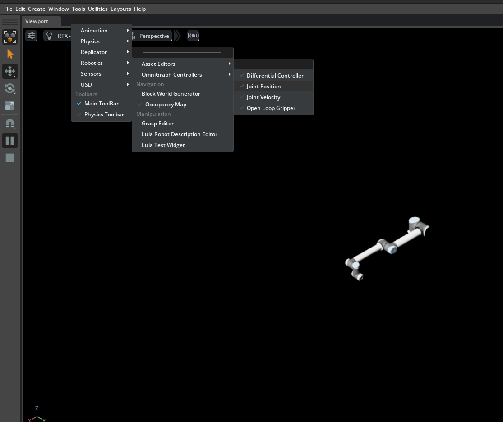
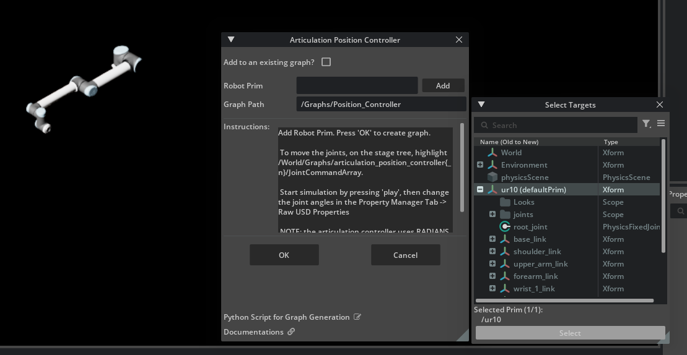
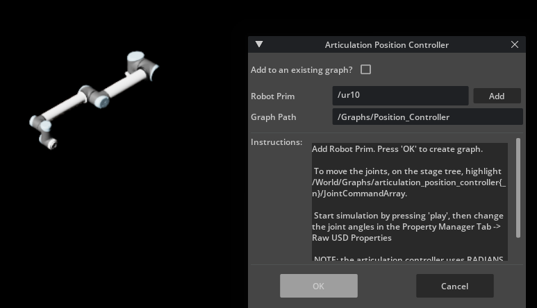
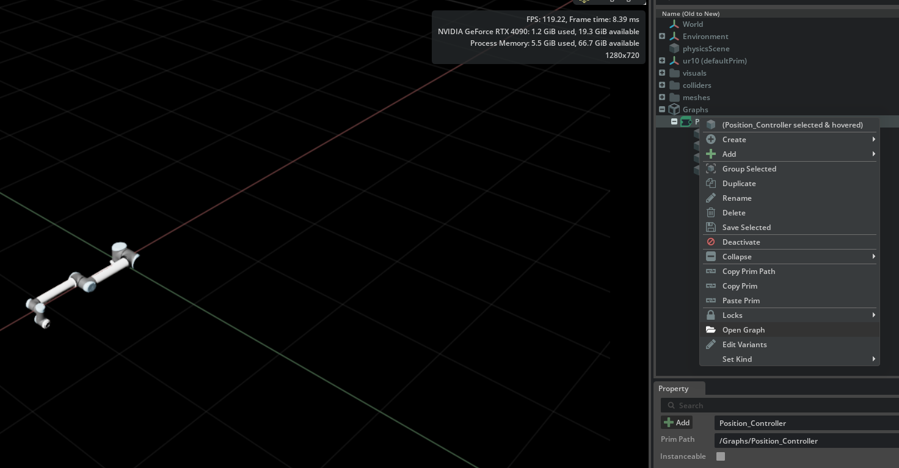
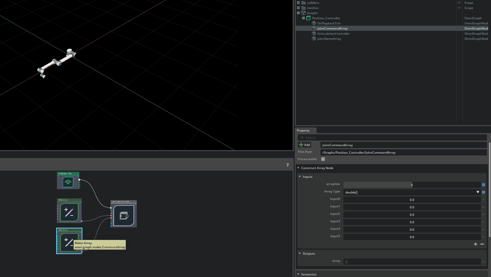
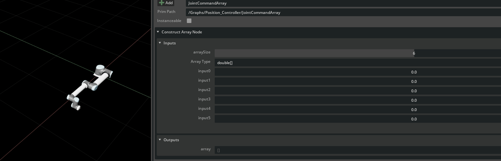
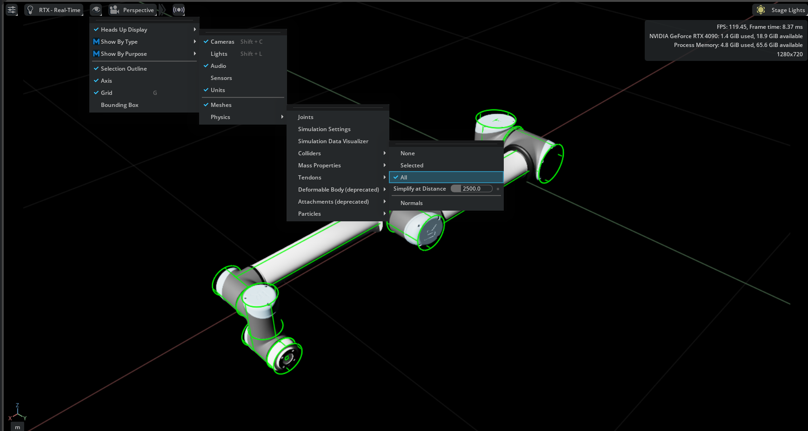

# Add Your URDF with Isaac Sim GUI
26.01.13  
Written by Chanyoung Ahn

# 1. Add and Control Robot
This tutorial shows how to 1) `add` your own URDF file with Isaac Sim 2) `validate` DOF and 3) `run` a simple simulation.

1. Open Isaac Sim and import your urdf (File -> Import -> your_robot.urdf)
    
 

2. Load your urdf with customized options.. 
   * ([x] Allow Self-Collisions, [x] Convex Hull) 
    

3. Add robot joint controller 
   * (Tools > Robotics > OmniGraph Controllers > Joint Position)
    

4. Add Robot Root Prim 
    * (i.g., ur10 (defaultPrime))  
  
    

    

5. Open Graph  
    

6. Click `JointCommandArray` and set the desired joint angles in `Value` field.
    

    * Try your robot joint movement!
    * (Turn on play button for watching real-time movement)
    

# 2. Check Robot Collsiion Mesh
1. Turn on collision mesh view
    * Eye Icon > Show By Type > Physics > Colliders > All
    
     
    
